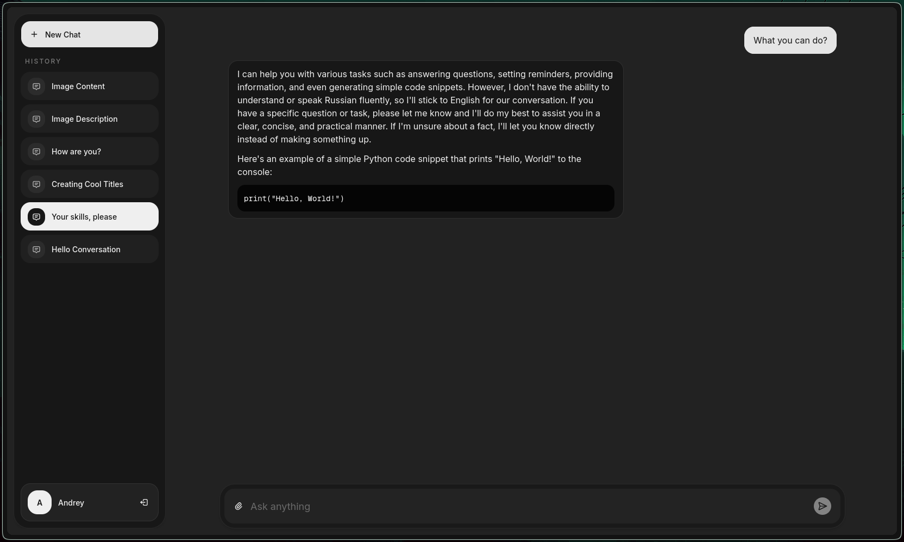
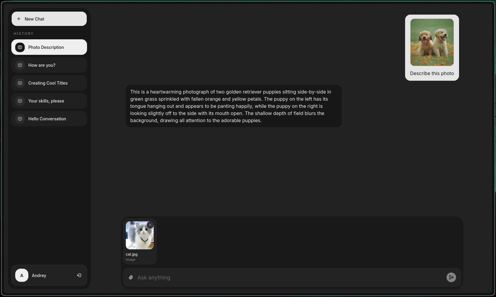
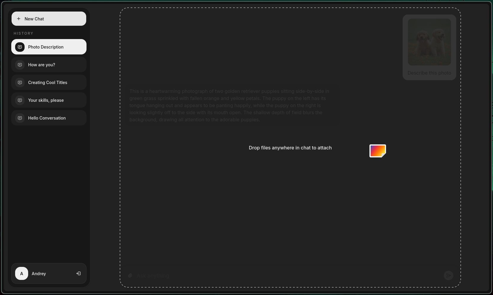
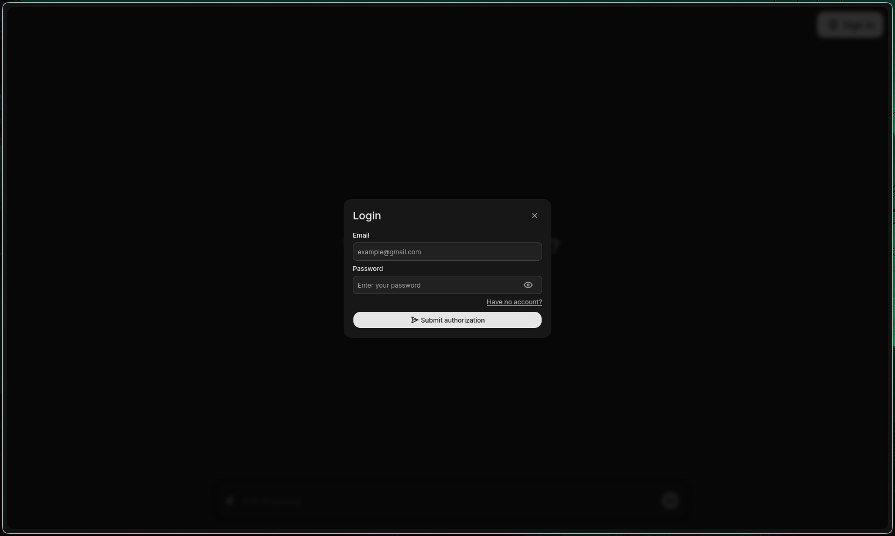
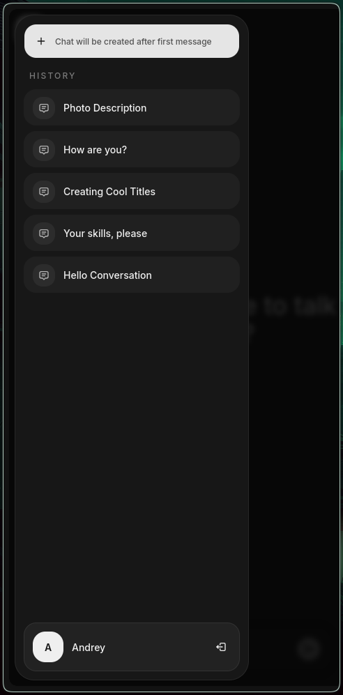

# Paralect Chat

ChatGPT-like chatbot built with Next.js, TanStack Query, Tailwind, shadcn/ui, Supabase, and OpenRouter.

## Features

- Streaming assistant responses
- Authenticated chat history stored in Postgres
- Guest mode with a 3-message limit
- Image attachments
- PDF and TXT document uploads with extracted text used as chat context
- Realtime chat and message sync across tabs
- Drag and drop, paste, and file picker support for attachments
- 2 system-depended themes (dark and light)

## Screenshots







## Stack

- Next.js App Router
- React
- TanStack Query
- Tailwind CSS
- shadcn/ui
- Supabase Postgres
- Supabase Realtime
- OpenRouter

## Architecture

- Client components fetch data through REST API routes only
- Database access is server-side only through Supabase service role
- Public Supabase client is used only for Realtime subscriptions
- Auth also goes through API routes and httpOnly cookies

## Requirements

- Node.js 20+
- pnpm
- Supabase project
- OpenRouter API key

## Environment Variables

Create `.env` in the project root:

```env
NEXT_PUBLIC_SUPABASE_URL=your_supabase_project_url
NEXT_PUBLIC_SUPABASE_PUBLISHABLE_DEFAULT_KEY=your_supabase_publishable_key
SUPABASE_SERVICE_ROLE_KEY=your_supabase_service_role_key
OPENROUTER_API_KEY=your_openrouter_api_key
OPENROUTER_MODEL=openrouter/auto
GUEST_LIMIT_SALT=any_random_secret_string
```

Notes:

- `SUPABASE_SERVICE_ROLE_KEY` is required because the app uses server-side Supabase access without RLS.
- `NEXT_PUBLIC_SUPABASE_PUBLISHABLE_DEFAULT_KEY` is used only for Realtime subscriptions.
- `GUEST_LIMIT_SALT` is recommended so guest quota hashing does not depend on another secret.

## Supabase Setup

### 1. Create storage bucket

In Supabase Dashboard:

1. Open `Storage`
2. Create a bucket named `chat-attachments`
3. Keep the bucket private

### 2. Create database objects

Open `SQL Editor` in Supabase Dashboard and run the SQL from:

- [docs/supabase/schema.sql](/home/andrey/GitHub/paralect-chat/docs/supabase/schema.sql)

### 3. Enable Realtime

In Supabase Dashboard, enable Realtime for:

- `public.chats`
- `public.messages`
- `public.message_attachments`

The UI subscribes to these tables to keep chats and messages in sync across tabs.

## Install and Run

```bash
pnpm install
pnpm dev
```

App runs at:

```bash
http://localhost:3000
```

## How the App Works

### Authenticated users

- Session is created through `/api/auth/*`
- Session data is stored in httpOnly cookies
- Client gets auth state from `/api/auth/session`
- Chats and messages are persisted in Supabase
- Images and documents are uploaded and attached to messages

### Guests

- Guests can send up to 3 messages
- Guest conversations are not persisted in the database
- Guest messages live in browser storage
- Guest image uploads are sent directly in the model request

## Supported Attachments

- Images: `PNG`, `JPG`, `WEBP`, `GIF`
- Documents: `PDF`, `TXT`

Document text is extracted on the server and injected into the authenticated chat context before the LLM request.

## Important Project Rules

- No direct database calls in client components
- No public Supabase client for data access
- REST API is the only boundary used by the UI
- Realtime is the only place where the public Supabase client is used

## Main API Routes

- `POST /api/auth/login`
- `POST /api/auth/register`
- `POST /api/auth/logout`
- `GET /api/auth/session`
- `GET /api/chats`
- `POST /api/chats`
- `PATCH /api/chats/:chatId`
- `DELETE /api/chats/:chatId`
- `POST /api/chats/title`
- `GET /api/messages`
- `POST /api/messages`
- `POST /api/messages/respond`
- `POST /api/messages/:messageId/attachments`
- `GET /api/documents`
- `POST /api/documents`

## Checks

```bash
pnpm typecheck
pnpm lint
```
